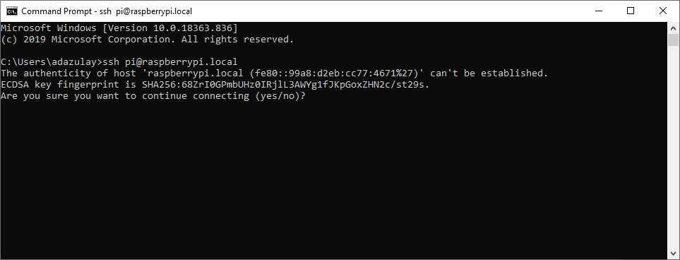
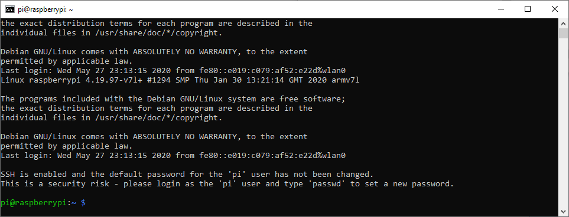
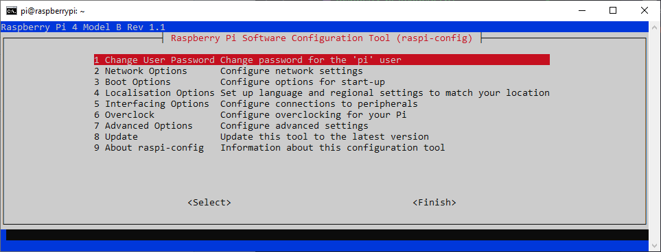
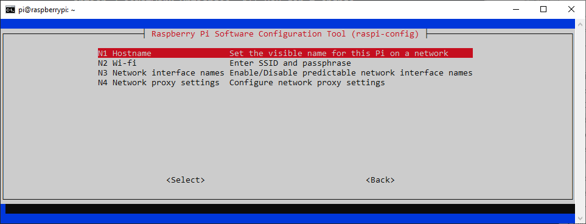
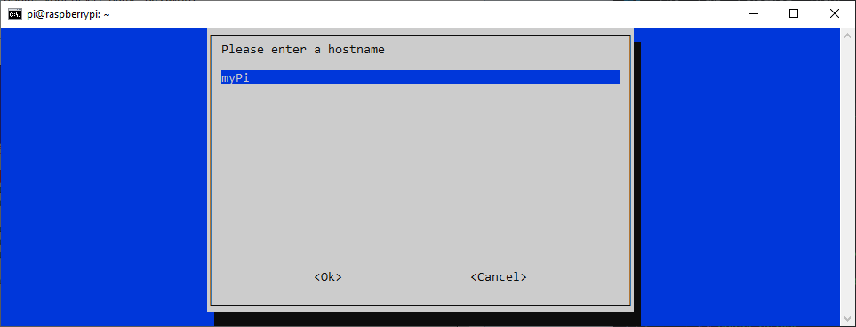
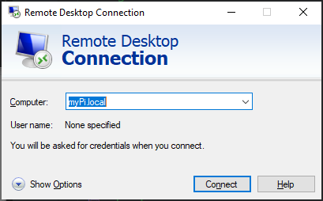
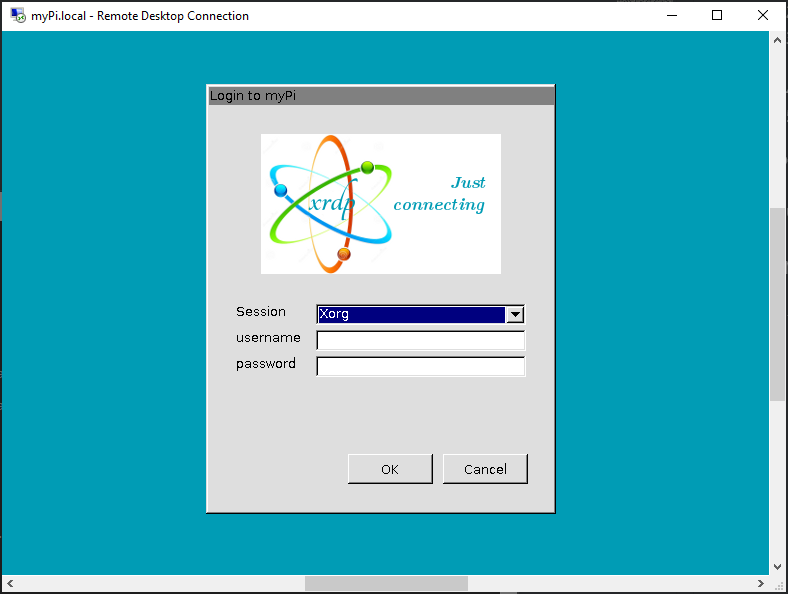
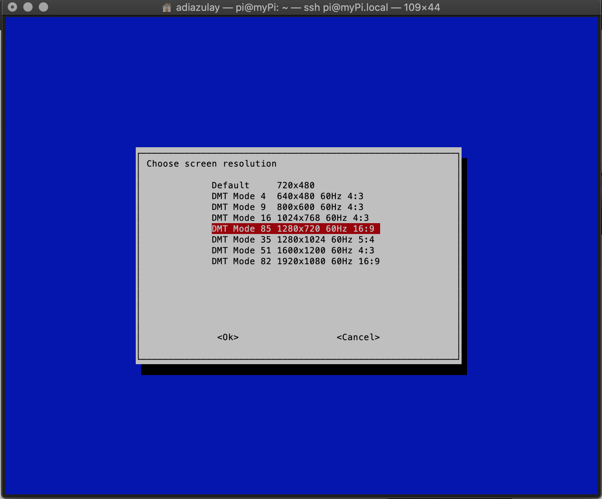
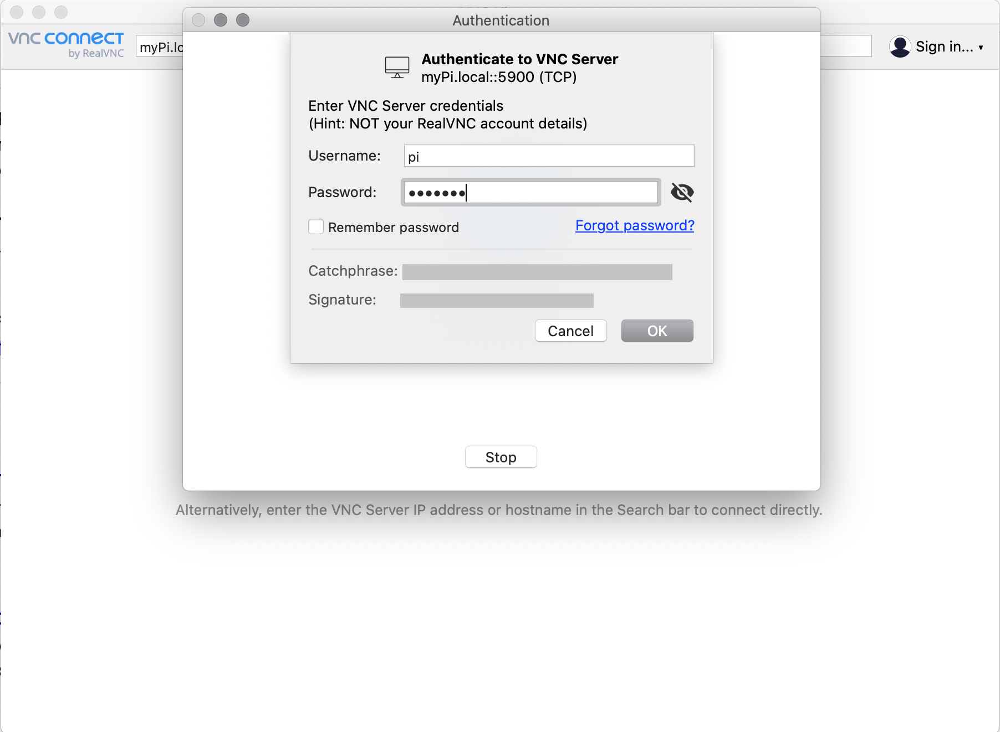
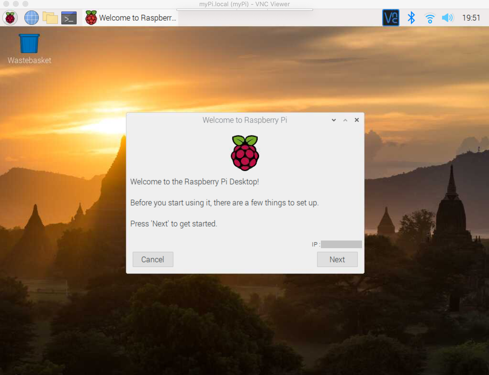

# Setting up the Raspberry Pi without a Monitor
In this tutorial you'll set up a Raspberry Pi in a headless configuration. Meaning you'll be able to use it without its own keyboard, mouse, or monitor. You will connect to it either over WiFi or using an ethernet cable. Using you Raspberry Pi in a headless configuration is handy if you don't have room to setup another monitor and keyboard or your Raspberry Pi is somewhere hard to reach. 
## Things you'll need
- Raspberry Pi
- Power cable
- Ethernet cable
- Ethernet adapter (if you computer doesn't have a built in port)
- Micro SD card
- Micro SD card reader
## Prepare your SD Card
In this section you'll prepare a new SD card to use in your Raspberry Pi.
1. Create your SD Card using [Raspberry Pi Imager](https://www.raspberrypi.org/blog/raspberry-pi-imager-imaging-utility/)
1. Select **CHOOSE OS**

1. Select **Raspian**

1. Select the SD card you want to image and press **WRITE**

*Note: this may take a few minutes to run*
## Setting up SSH and WiFi
1. Once the imager is done, eject and reinsert SD Card. Open the SD card directory in file explorer.
1. Copy the ssh file from this repository on to the SD Card. If you your Raspberry Pi supports WiFi (Pi0/3/4) also copy the wpa_supplicant.conf and follow the steps below (you can also skip these steps and step WiFi later):
    1. Open *wpa_supplicant.conf* in a text editor
    1. Enter your country as a 2 letter abbreviation. If you're not sure what your country's abbreviation is you can set it to US, and update it later.
    1. Add the Network name and password in to the file
    1. Save and close the file

*What are these files? ssh is an empty file that lets Raspian know to enable Secured Socket Host when first initializing the operating system. wpa_supplicant.conf allows you to enter your WiFi credentials at setup.*

## Configuring your Raspberry Pi
In the following section you'll connect to Raspberry Pi from you computer, change the password, and update the operating system.

0. (Skip this step if you're connected to WiFi) Connect your Raspberry Pi to your computer with an ethernet cable
1. Insert the Micro SD card into the SD card slot on the Raspberry Pi
1. Connect your Raspberry Pi to a power source
1. On your computer open Command Prompt (windows) or Terminal (mac)
1. Type `ssh pi@raspberrypi.local -o UserKnownHostsFile=/dev/null`. *Note: we use the **UserKnownHostsFile=/dev/null** option here in order to not save the hostname to our ssh Known Host record. We only do this the first time we connect because we're going to change the Host Name.*
1. You will be asked if you trust this source, say yes

1. You will be prompted for a password, enter `raspberry` 

1. Now that you're in your Raspberry Pi you'll want to change the password. Type `sudo raspi-config` to ope the configuration tool
1. Select option 1 **Change User Password**

1. Enter a new password
1. Next you'll want to change the host name. Select option 2 **Network Options**. Then select option N1 **Hostname**. *If you don't change the host name you will run into problems if you try to setup another Raspberry Pi in a headless configuration.*

1. Make sure to choose a unique name for each device you set up.

1. Next choose option 8 **Update**
1. After the update completes, choose **Finish**. Your Raspberry Pi should automatically disconnect.
1. In command prompt type `ssh pi@<YOUR-DEVICE-NAME>.local`
1. Enter your new password, now you're back in your Raspberry Pi's command line interface.
1. Optional: It's good practice to update the operating system and any packages that are installed the first time you run it. To do that type `sudo apt-get update` and `sudo apt-get upgrade`. This may take a few minutes to run.

If you are comfortable working in Linux command line you can stop here. If you prefer to work in a desktop environment the next section will walk you through setting up Remote Desktop.

## Remote Desktop
### Windows set up
1. If you're using Windows you'll need to install Remote Desktop to do that type `sudo apt-get install xrdp` this will take a few minutes.
1. Open remote Desktop on you computer, and enter the hostname you gave your Raspberry Pi

1. Enter your user name and password.

1. You're all set, now you have access to your Raspberry Pi desktop.

### Mac OS set up
1. If you are using a Mac RealVNC is already installed, but you'll have to change the screen resolution to anything besides the default. To do that type `sudo raspi-config`
1. Select option 7 **Advanced Options**
1. Select option A5 **Screen Resolution**
1. Choose any resolution other than the default

1. Your Raspberry Pi will reboot
1. On your Mac download [RealVNC viewer](https://www.realvnc.com/en/connect/download/viewer/macos/)
1. Read through the EULA and the privacy notices before accepting. You will also be asked to allow access to the accessibility features of your computer.
1. In RealVNC enter the hostname you gave your device

1. Log in with your user name and password.

1. You can now access the Raspberry Pi's desktop from your Mac

    

